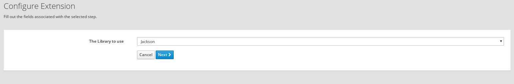

# Json Dataformat Extension

This is Syndesis Extension to marshal/unmarshall using the json Dataformat

The extension exposes one configurable field:
- **kind** the kind of library. Possible values: Jackson, Fastjson, Xstream, Gson

