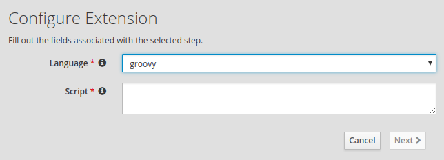

# Syndesis Script Extension

This is a simple Syndesis Extension to add dynamic scripting to Syndesis.  

It allows to invoke Groovy/JavaScript code in a context that has the following variables available in the execution context:

- `env` --> `System.getenv()`
- `sys` --> `System.getProperties()`
- `body` --> Is the content of `Exchange.getIn().getBody()` or  `Exchange.getOut().getBody()` that you would be able to access in a normal Camel Processor
- `message`  --> Is the content of `Exchange.getIn()` or `Exchange.getOut()`
- `exchange` --> Is the `Exchange` you would be able to access in a Camel Processor, that gives you access to `Body`, `Headers`, `Properties` and `CamelContext`.


The extension exposes two configurable fields:
- **language** which let you choose the scripting engine (Groovy/JavaScript)
- **script** in which you paste the content of your script.

## Example

To apply a very simple transformation you can write:

```java
println "Hello World, this is current body: $body";
exchange.in.body="{'key':'NEW_BODY'}"
```

_You can see that you have implicit access to the `exchange` variable, as described above._

