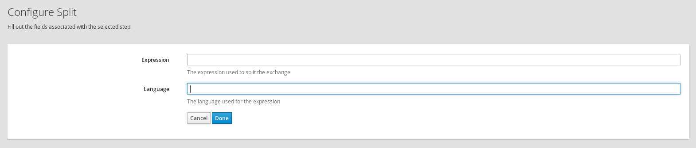

# Delay Extension

This is a simple Syndesis Extension to split an exchange.

The extension exposes the following configurable field:
- **language** the language used for the expression
- **expression** the expression used to split the exchange

If language and expression are not set, the extension tries to split the body if it is a Collection, an Iterator or an Array.

