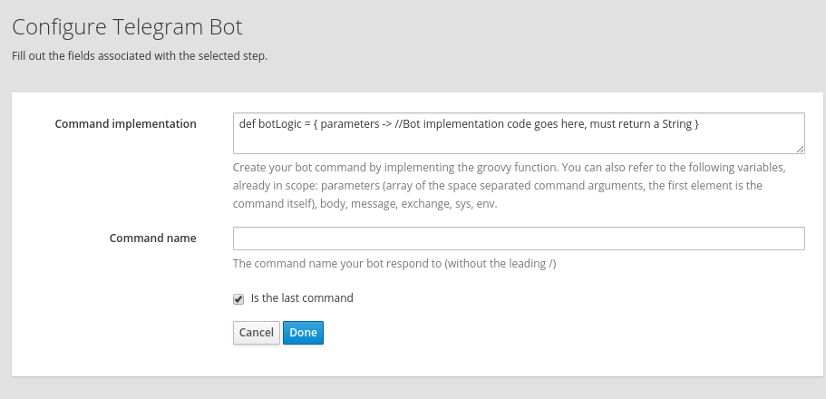

# Telegram Bot Extension

This is a simple Syndesis Extension to help crating the logic of a Telegram Bot. 

It allows to implement in Groovy the logic of a Telegram Bot in a preconfigured environment that has the following variables available in the execution context:
- `env` --> `System.getenv()`
- `sys` --> `System.getProperties()`
- `body` --> Is the content of `Exchange.getIn().getBody()` or  `Exchange.getOut().getBody()` that you would be able to access in a normal Camel Processor
- `message`  --> Is the content of `Exchange.getIn()` or `Exchange.getOut()`
- `exchange` --> Is the `Exchange` you would be able to access in a Camel Processor, that gives you access to `Body`, `Headers`, `Properties` and `CamelContext`.
- `parameters` --> an array containing the command parameters as received and split at spaces (parameters[0] contains the command itself)

Ideally this step would be used in between 2 Telegram Connectors.

The extension exposes tree configurable fields:
- **Command implementation** in which you implement: `def botLogic = { parameters -> //Bot implementation code goes here, must return a String }`.
- **Command name** in which you specify the command your bot will respond to (omitting the leading /).
- **Is the last command** in case you want to implement multiple commands you can keep adding Telegram Bot steps being careful that this option is active only for the last one.

## Example

To implement a bot that says Hi you can write as Command implementation:

```groovy
def botLogic = { parameters -> "Hi!" }
```
and as Command name:
```
hi
```
in this way when someone says `/hi` to the bot, it will answer with a message containing `Hi!`.


