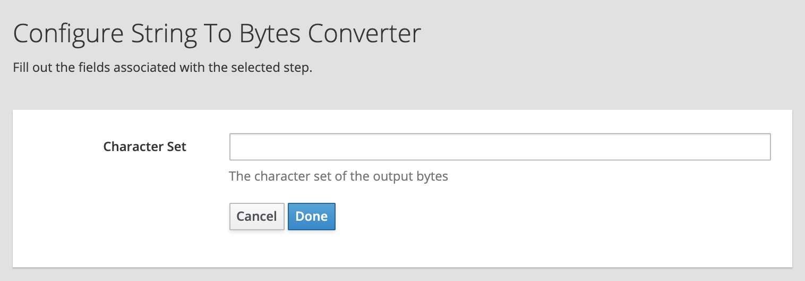
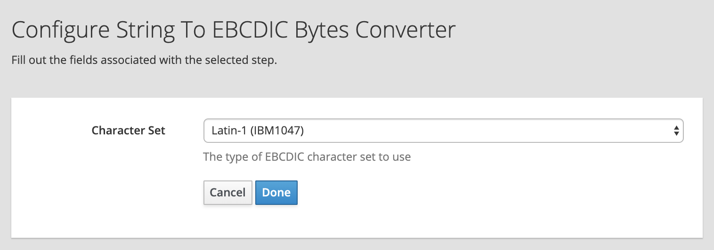

# Charset Conversion Extension

This is a simple Syndesis Extension to convert text to/from different formats. For example, it can be used to convert EBCDIC bytes and vice-versa.

## Base64 To Bytes Converter

This action can be used to convert a Base64 encoded string into an array of bytes.

The action has no configurable fields.

## Bytes To Base64 Converter

This action can be used to convert an array of bytes into a Base64 encoded string.

The action has no configurable fields.

## Hex To Bytes Converter

This action can be used to convert a Hex encoded string into an array of bytes.

The action has no configurable fields.

## Bytes To Hex Converter

This action can be used to convert an array of bytes into a Hex encoded string.

The action has no configurable fields.

## String To Bytes Converter

This action can be used to convert a string into an array of bytes with a specified character set.

The action exposes one configurable field:
- **Character Set** The type of character set to use

## Bytes To String Converter

This action can be used to convert an array of bytes with a specified character set into a string.

The action exposes one configurable field:
- **Character Set** The type of character set to use

## String to EBCDIC Bytes Converter

This action can be used to convert a string into an array of bytes with a specified EBCDIC character set.

The action exposes one configurable field:
- **Character Set** The type of EBCDIC character set to use

## EBCDIC Bytes To String Converter

This action can be used to convert a string into an array of bytes with a specified EBCDIC character set.

The action exposes one configurable field:
- **Character Set** The type of EBCDIC character set to use

