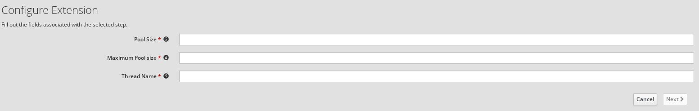

# Threads Extension

This is a simple Syndesis Extension to set Threads EIP.

The extension exposes one configurable field:
- **poolsize** Minimum number of threads in the pool (and initial pool size)
- **maxpoolsize** Maximum number of threads in the pool
- **threadname** The Thread name

