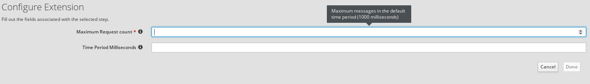

# Throttle Extension

This is a simple Syndesis Extension to set Throttle EIP.

The extension exposes one configurable field:
- **maxRequestCount** Maximum Request Count in the time period
- **timePeriodMilliseconds** Time window in which throttle is applied

