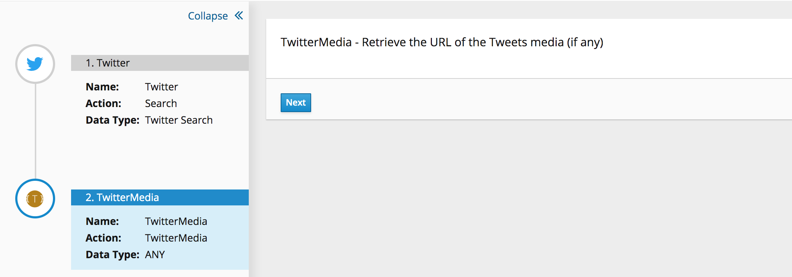

# Twitter Media Object Extension

This is a simple Syndesis Extension to retrieve a Media Object from an Tweet.

Output JSON looks like:
```JSON
{
	"twitterID": 2223520890,
	"twitterName": "Roel Hodzelmans",
	"twitterScreenName": @RoelHodzelmans,
	"tweetCreatedAt": "2019-10-24 15:40:50",
	"url":[
		"http:\/\/pbs.twimg.com\/media\/EHqEQBvWwAIIVQP.jpg",
		"http:\/\/pbs.twimg.com\/media\/EHqEQB8XYAA5ev5.jpg"
	]
}
```

If there is no Media Object available in the Tweet, the output body will be overwritten by a null object.

